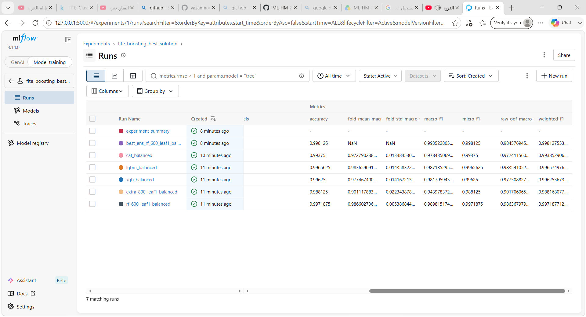

# Final Report: Anonymized Classification Challenge

## 1. Project Overview

This project solves a multi-class classification problem using an anonymized tabular dataset with 21 hidden features. Since the feature meanings are unknown, the solution focuses on robust validation, model comparison, and reproducible experiment tracking.

The target classes are `class1`, `class2`, and `class3`. The final output is a Kaggle submission file containing two columns: `ID` and `target`.

## 2. Dataset

The project uses the following files:

- `train_data.csv`: Training data with `ID`, 21 anonymized features, and the target label.
- `test_data.csv`: Test data with `ID` and the same 21 anonymized features.
- `sample_submission.csv`: Reference submission format.

The test set was used only to generate the final submission. It was not used for training, validation, model selection, or hyperparameter tuning.

## 3. Validation Strategy

The solution uses 5-fold Stratified Cross Validation on the training data. In each fold, the model is trained on 80% of the training data and validated on the remaining 20%.

Stratification preserves the class distribution across folds, which is important because the dataset is imbalanced. The main validation metric is Macro F1-score, matching the competition objective.

## 4. Models

Several tree-based models were evaluated because they work well on anonymized tabular data:

- RandomForestClassifier
- ExtraTreesClassifier
- XGBoostClassifier
- LightGBMClassifier
- CatBoostClassifier

The best model is an ensemble of:

`RandomForest + ExtraTrees + XGBoost + CatBoost`

Each estimator is implemented as an sklearn `Pipeline` with:

`SimpleImputer(strategy="median") + model`

This means preprocessing and model training are kept together and reproducible.

## 5. MLflow Experiment Tracking

MLflow was integrated into `experiment_boosting_f1.py` to track model experiments automatically.

For each run, MLflow logs:

- Model/run name
- Random seed
- Number of folds
- Feature count
- Class multipliers
- Accuracy
- Macro F1-score
- Weighted F1-score
- Micro F1-score
- Raw OOF Macro F1-score
- Fold mean and fold standard deviation

MLflow also saves artifacts, including:

- Submission CSV files
- Fold metrics
- Dataset metadata
- Best model bundle with preprocessing and trained estimators

## 6. MLflow Dashboard Screenshot

The screenshot below shows the MLflow comparison table with multiple tracked runs and their metrics.



## 7. Results

The best tracked run is:

`best_ens_rf_600_leaf1_balanced+extra_800_leaf1_balanced+xgb_balanced+cat_balanced`

Its validation metrics are:

| Metric | Value |
|---|---:|
| Accuracy | 0.998125 |
| Macro F1 | 0.993523 |
| Weighted F1 | 0.998128 |
| Micro F1 | 0.998125 |

The final selected model is the ensemble because it achieved the highest tuned out-of-fold Macro F1-score.

## 8. Reproducibility

To rerun the MLflow-tracked experiment:

```powershell
cd "D:\ML_HM_FINISH_2\MLOPS"
python experiment_boosting_f1.py
```

To open the MLflow dashboard:

```powershell
python -m mlflow ui --backend-store-uri sqlite:///D:/ML_HM_FINISH_2/MLOPS/mlflow.db --host 127.0.0.1 --port 5000
```

Then open:

```text
http://127.0.0.1:5000
```

## 9. DVC Data Versioning

The dataset is tracked using DVC. The raw CSV files are not uploaded directly to GitHub; only the `.dvc` pointer files are committed.

A local DVC remote was configured at:

`D:\ML_HM_FINISH_2_DVC_REMOTE`

A teammate can clone the repository, install DVC, mount or place the shared DVC remote at the configured path, and run:

```powershell
dvc pull
```

This restores the tracked dataset without storing heavy raw data files in Git.

## 10. Final Notes

The final solution is reproducible, uses cross-validation for model selection, tracks experiments with MLflow, and manages data files using DVC. No test labels, manual submission edits, or data leakage are used.
